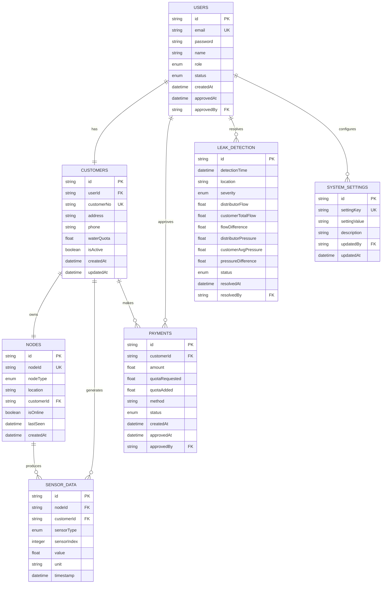

# PDAM Database Schema Illustration

## 📋 Tables Overview

### **1. Users Table** (Login & Authentication)
| Field | Type | Description | Example |
|-------|------|-------------|---------|
| id | String | Primary Key | "user_123abc" |
| email | String | Login email (unique) | "budi@gmail.com" |
| password | String | Hashed password | "$2b$10$..." |
| name | String | Full name | "Budi Santoso" |
| role | Enum | ADMIN / CUSTOMER | "CUSTOMER" |
| status | Enum | PENDING / ACTIVE / INACTIVE | "PENDING" |
| createdAt | DateTime | Registration time | "2024-01-15 10:30:00" |
| approvedAt | DateTime | When admin approved | "2024-01-16 09:15:00" |
| approvedBy | String | Admin ID who approved | "admin_456def" |

**Business Logic:**
- User register → status = PENDING
- Admin approve → status = ACTIVE + approvedAt filled
- Only ACTIVE users can login to system

---

### **2. Customers Table** (Customer Details)
| Field | Type | Description | Example |
|-------|------|-------------|---------|
| id | String | Primary Key | "cust_789ghi" |
| userId | String | Foreign Key to Users | "user_123abc" |
| customerNo | String | PDAM customer number | "PDAM-2024-001" |
| address | String | Home address | "Jl. Merdeka No. 123" |
| phone | String | Phone number | "08123456789" |
| waterQuota | Float | Current water balance (Liter) | 500.75 |
| isActive | Boolean | Service active status | true |

**Business Logic:**
- customerNo assigned by admin after approval
- waterQuota increased when top-up approved
- waterQuota decreased when water consumed

---

### **3. Nodes Table** (ESP32 Hardware Devices)
| Field | Type | Description | Example |
|-------|------|-------------|---------|
| id | String | Primary Key | "node_001xyz" |
| nodeId | String | Hardware identifier | "DIST-001" |
| nodeType | Enum | DISTRIBUTOR / CUSTOMER | "DISTRIBUTOR" |
| location | String | Physical location | "Main Distribution Pipe" |
| customerId | String | Linked customer (null for distributor) | "cust_789ghi" |
| isOnline | Boolean | Connection status | true |
| lastSeen | DateTime | Last communication | "2024-01-16 14:25:00" |

**Node Examples:**
- **DIST-001**: Distributor node (not linked to customer)
- **USER-001**: Customer Budi's house node
- **USER-002**: Customer Sari's house node

---

### **4. Sensor Data Table** (Real-time Sensor Readings)
| Field | Type | Description | Example |
|-------|------|-------------|---------|
| id | String | Primary Key | "data_abc123" |
| nodeId | String | Which ESP32 sent this | "USER-001" |
| customerId | String | Related customer (null for distributor) | "cust_789ghi" |
| sensorType | Enum | FLOW_METER / PRESSURE | "FLOW_METER" |
| sensorIndex | Integer | Sensor number (for multiple sensors) | 1 |
| value | Float | Sensor reading | 15.5 |
| unit | String | Measurement unit | "L/min" |
| timestamp | DateTime | When data was recorded | "2024-01-16 14:25:30" |

**Sensor Configuration:**
```
Distributor (DIST-001):
- Flow Sensor #1 → monitors flow to Customer 1
- Flow Sensor #2 → monitors flow to Customer 2  
- Pressure Sensor #1 → main pipe pressure

Customer 1 (USER-001):
- Flow Sensor #1 → house consumption
- Pressure Sensor #1 → house pressure

Customer 2 (USER-002):
- Flow Sensor #1 → house consumption
- Pressure Sensor #1 → house pressure
```

---

### **5. Payments Table** (Top-up Transactions)
| Field | Type | Description | Example |
|-------|------|-------------|---------|
| id | String | Primary Key | "pay_def456" |
| customerId | String | Who made payment | "cust_789ghi" |
| amount | Float | Payment amount (IDR) | 50000.00 |
| quotaRequested | Float | Water requested (Liter) | 1000.0 |
| quotaAdded | Float | Water actually added | 1000.0 |
| method | Enum | TRANSFER / CASH / DIGITAL | "TRANSFER" |
| status | Enum | PENDING / COMPLETED / REJECTED | "PENDING" |
| proofImage | String | Payment proof file path | "/uploads/payment_123.jpg" |
| createdAt | DateTime | Payment request time | "2024-01-16 08:00:00" |
| approvedAt | DateTime | Admin approval time | "2024-01-16 10:30:00" |
| approvedBy | String | Admin who approved | "admin_456def" |

**Business Logic:**
- Customer request top-up → status = PENDING
- Admin approve → status = COMPLETED + quotaAdded to customer
- Admin reject → status = REJECTED

---

### **6. Leak Detection Table** (Automated Leak Alerts)
| Field | Type | Description | Example |
|-------|------|-------------|---------|
| id | String | Primary Key | "leak_ghi789" |
| detectionTime | DateTime | When leak was detected | "2024-01-16 12:45:00" |
| location | String | Where leak detected | "Between DIST-001 and USER-001" |
| severity | Enum | LOW / MEDIUM / HIGH | "MEDIUM" |
| distributorFlow | Float | Flow at distributor | 25.5 |
| customerFlow | Float | Flow at customer | 20.2 |
| flowDifference | Float | Calculated difference | 5.3 |
| status | Enum | DETECTED / RESOLVED / FALSE_ALARM | "DETECTED" |
| resolvedAt | DateTime | When issue was fixed | null |
| resolvedBy | String | Admin who marked resolved | null |

---

## 🔗 **Table Relationships**

### **Primary Relationships:**
```
Users (1) ←→ (1) Customers
Users (1) ←→ (many) Payments (as approver)
Customers (1) ←→ (many) Payments
Customers (1) ←→ (many) Sensor Data  
Customers (1) ←→ (1) Nodes
Nodes (1) ←→ (many) Sensor Data
```

### **Data Flow Example:**
```
Registration Flow:
User registers → Users.status = PENDING
Admin approves → Users.status = ACTIVE + Customers.customerNo assigned

Top-up Flow:
Customer requests → Payments.status = PENDING
Admin approves → Payments.status = COMPLETED + Customers.waterQuota increased

Monitoring Flow:
ESP32 sends data → Sensor Data created
System checks → Leak Detection if anomaly
Admin monitors → All data visible in dashboard
```

---

## 📊 **Sample Data Scenario**

### **Case: 2 Active Customers**

#### **Users:**
| name | email | role | status | customerNo |
|------|-------|------|--------|------------|
| Admin | admin@pdam.com | ADMIN | ACTIVE | - |
| Budi | budi@gmail.com | CUSTOMER | ACTIVE | PDAM-2024-001 |
| Sari | sari@gmail.com | CUSTOMER | ACTIVE | PDAM-2024-002 |

#### **Hardware Setup:**
| nodeId | nodeType | location | customerId |
|--------|----------|----------|------------|
| DIST-001 | DISTRIBUTOR | Main Pipe | null |
| USER-001 | CUSTOMER | Budi's House | cust_budi |
| USER-002 | CUSTOMER | Sari's House | cust_sari |

#### **Sensor Configuration:**
| nodeId | sensorType | sensorIndex | purpose |
|--------|------------|-------------|---------|
| DIST-001 | FLOW_METER | 1 | Flow to Budi |
| DIST-001 | FLOW_METER | 2 | Flow to Sari |
| DIST-001 | PRESSURE | 1 | Main pipe pressure |
| USER-001 | FLOW_METER | 1 | Budi's consumption |
| USER-001 | PRESSURE | 1 | Budi's house pressure |
| USER-002 | FLOW_METER | 1 | Sari's consumption |
| USER-002 | PRESSURE | 1 | Sari's house pressure |

#### **Leak Detection Logic:**
```
IF (DIST-001 Flow1 + DIST-001 Flow2) > (USER-001 Flow + USER-002 Flow + threshold)
THEN create leak detection alert

Example:
Distributor total: 30 L/min (15+15)
Customer total: 25 L/min (12+13)
Difference: 5 L/min → LEAK DETECTED!
```

---

# PDAM Database Schema - Final Design

## 📋 **Confirmed Requirements**
- **CustomerNo Format**: "PDAM-001" (simple increment)
- **Water Quota Unit**: Liter 
- **Sensor Frequency**: 1-10 seconds (configurable)
- **Leak Threshold**: Admin-configurable, compare distributor vs customer flow+pressure
- **Payment**: Prototype only (no real payment proof needed)

---

## 📊 **Final Tables Structure**

### **1. Users Table** (Authentication)
| Field | Type | Description | Example |
|-------|------|-------------|---------|
| id | String | Primary Key | "user_123abc" |
| email | String | Login email (unique) | "budi@gmail.com" |
| password | String | Hashed password | "$2b$10$..." |
| name | String | Full name | "Budi Santoso" |
| role | Enum | ADMIN / CUSTOMER | "CUSTOMER" |
| status | Enum | PENDING / ACTIVE / INACTIVE | "PENDING" |
| createdAt | DateTime | Registration time | "2024-01-15 10:30:00" |
| approvedAt | DateTime | When admin approved | "2024-01-16 09:15:00" |
| approvedBy | String | Admin ID who approved | "admin_456def" |

### **2. Customers Table** (Customer Details)
| Field | Type | Description | Example |
|-------|------|-------------|---------|
| id | String | Primary Key | "cust_789ghi" |
| userId | String | Foreign Key to Users | "user_123abc" |
| customerNo | String | Simple PDAM number | "PDAM-001" |
| address | String | Home address | "Jl. Merdeka No. 123" |
| phone | String | Phone number | "08123456789" |
| waterQuota | Float | Current water balance (Liter) | 500.75 |
| isActive | Boolean | Service active status | true |

### **3. Nodes Table** (ESP32 Hardware)
| Field | Type | Description | Example |
|-------|------|-------------|---------|
| id | String | Primary Key | "node_001xyz" |
| nodeId | String | Hardware identifier | "DIST-001" |
| nodeType | Enum | DISTRIBUTOR / CUSTOMER | "DISTRIBUTOR" |
| location | String | Physical location | "Main Distribution Pipe" |
| customerId | String | Linked customer (null for distributor) | "cust_789ghi" |
| isOnline | Boolean | Connection status | true |
| lastSeen | DateTime | Last communication | "2024-01-16 14:25:00" |

### **4. Sensor Data Table** (Real-time Readings)
| Field | Type | Description | Example |
|-------|------|-------------|---------|
| id | String | Primary Key | "data_abc123" |
| nodeId | String | Which ESP32 sent this | "USER-001" |
| customerId | String | Related customer (null for distributor) | "cust_789ghi" |
| sensorType | Enum | FLOW_METER / PRESSURE | "FLOW_METER" |
| sensorIndex | Integer | Sensor number (1,2,3...) | 1 |
| value | Float | Sensor reading | 15.5 |
| unit | String | Measurement unit | "L/min" or "Bar" |
| timestamp | DateTime | When data recorded | "2024-01-16 14:25:30" |

### **5. Payments Table** (Top-up Prototype)
| Field | Type | Description | Example |
|-------|------|-------------|---------|
| id | String | Primary Key | "pay_def456" |
| customerId | String | Who made payment | "cust_789ghi" |
| amount | Float | Payment amount (IDR) | 50000.00 |
| quotaRequested | Float | Water requested (Liter) | 1000.0 |
| quotaAdded | Float | Water actually added | 1000.0 |
| method | String | Payment method | "Virtual Payment" |
| status | Enum | PENDING / COMPLETED / REJECTED | "PENDING" |
| createdAt | DateTime | Payment request time | "2024-01-16 08:00:00" |
| approvedAt | DateTime | Admin approval time | "2024-01-16 10:30:00" |
| approvedBy | String | Admin who approved | "admin_456def" |

### **6. Leak Detection Table** (Automated Alerts)
| Field | Type | Description | Example |
|-------|------|-------------|---------|
| id | String | Primary Key | "leak_ghi789" |
| detectionTime | DateTime | When leak detected | "2024-01-16 12:45:00" |
| location | String | Affected area | "Customer PDAM-001 Area" |
| severity | Enum | LOW / MEDIUM / HIGH | "MEDIUM" |
| distributorFlow | Float | Total distributor flow | 25.5 |
| customerTotalFlow | Float | Sum of customer flows | 20.2 |
| flowDifference | Float | Calculated difference | 5.3 |
| distributorPressure | Float | Distributor pressure | 2.5 |
| customerAvgPressure | Float | Average customer pressure | 2.1 |
| pressureDifference | Float | Pressure difference | 0.4 |
| status | Enum | DETECTED / RESOLVED / FALSE_ALARM | "DETECTED" |
| resolvedAt | DateTime | When issue fixed | null |
| resolvedBy | String | Admin who resolved | null |

### **7. System Settings Table** (Admin Configuration)
| Field | Type | Description | Example |
|-------|------|-------------|---------|
| id | String | Primary Key | "setting_001" |
| settingKey | String | Configuration key | "leak_flow_threshold_percent" |
| settingValue | String | Configuration value | "10" |
| description | String | What this setting does | "Flow difference % to trigger leak alert" |
| updatedBy | String | Admin who changed | "admin_456def" |
| updatedAt | DateTime | When changed | "2024-01-16 15:00:00" |

**Admin Configurable Settings:**
- `leak_flow_threshold_percent`: 10 (%)
- `leak_pressure_threshold_bar`: 0.5 (Bar)
- `sensor_data_frequency_seconds`: 5 (seconds)
- `auto_valve_close_quota_limit`: 0 (Liter)

---

## 🔗 **Database Relationships Diagram**



---

## 📊 **Sample Hardware Setup (2 Customers)**

### **Nodes Configuration:**
| nodeId | nodeType | location | customerId | sensors |
|--------|----------|----------|------------|---------|
| DIST-001 | DISTRIBUTOR | Main Pipe | null | Flow1, Flow2, Pressure1 |
| USER-001 | CUSTOMER | PDAM-001 House | cust_001 | Flow1, Pressure1 |
| USER-002 | CUSTOMER | PDAM-002 House | cust_002 | Flow1, Pressure1 |

### **Leak Detection Algorithm:**
```javascript
// Compare total flows
distributorTotal = DIST-001.Flow1 + DIST-001.Flow2
customerTotal = USER-001.Flow1 + USER-002.Flow1
flowDiff = distributorTotal - customerTotal

// Compare pressures  
distributorPressure = DIST-001.Pressure1
customerAvgPressure = (USER-001.Pressure1 + USER-002.Pressure1) / 2
pressureDiff = distributorPressure - customerAvgPressure

// Check thresholds (from admin settings)
flowThreshold = getSetting("leak_flow_threshold_percent") // 10%
pressureThreshold = getSetting("leak_pressure_threshold_bar") // 0.5

if (flowDiff > (distributorTotal * flowThreshold/100) || 
    pressureDiff > pressureThreshold) {
    createLeakAlert()
}
```

---

## ✅ **Final Confirmation**

- **Simple customer numbering**: PDAM-001, PDAM-002, etc.
- **Liter-based quota**: Easy calculation and user understanding
- **Configurable sensors**: 1-10 second frequency via admin settings
- **Admin-controlled thresholds**: Flow % and pressure difference
- **Prototype payments**: No real money, just approval workflow

**Ready to implement with Prisma? 🚀**